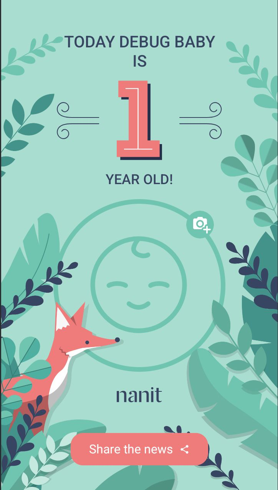
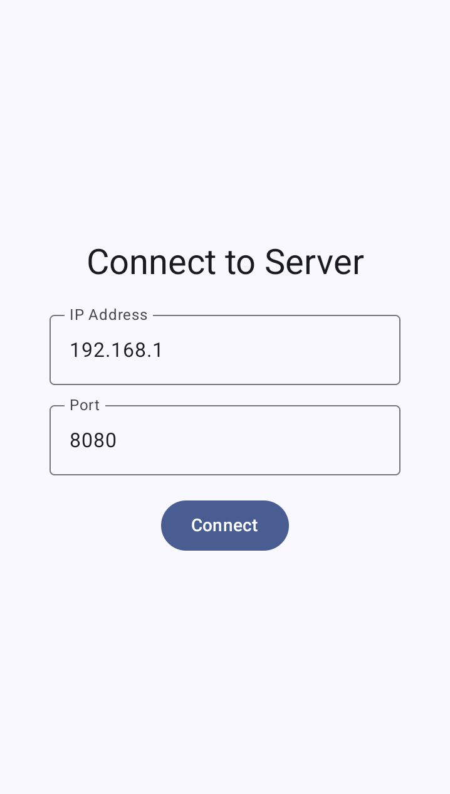

# Nanit Birthday App

A simple Android app that pulls a baby's birthday from a local server, shows a celebration screen, and lets you add a photo to share.

## Screenshots

| Connection Screen | Birthday Celebration |
|:-----------------:|:--------------------:|
|  |  |

## What it Does

*   **Connects to a Server**: Grabs birthday data from a local WebSocket server.
*   **Themed UI**: The background and colors change based on the baby's theme (e.g., "fox", "pelican").
*   **Calculates Age**: Shows the baby's age in years or months.
*   **Picks Photos**: Lets you choose a photo from the gallery or take a new one with the camera.
*   **Saves Photos**: Remembers the photo you picked for each baby.
*   **Shares Images**: Takes a screenshot of the celebration screen so you can share it.

## Architecture

The app is built using **Clean Architecture** to keep things organized and easy to manage. The goal is to separate the business logic from the UI and data sources.

Here's the breakdown:

-   **`UI (Presentation)`**: The user-facing part of the app, built with Jetpack Compose. It gets data from the `ViewModel`.
-   **`Domain`**: The core logic. This layer is pure Kotlin and has no Android dependencies. It defines the "what" of the app (e.g., "get birthday info").
-   **`Data`**: The implementation layer. It's responsible for actually getting the data, whether from a WebSocket or local `SharedPreferences`.

## Tech Stack

This project uses a modern Android tech stack.

-   **UI**: 100% Jetpack Compose.
-   **DI**: Hilt for dependency injection.
-   **Networking**: Ktor Client for WebSockets.
-   **Async**: Kotlin Coroutines & Flow.
-   **Image Loading**: Coil for loading images into Composables.
-   **JSON**: Kotlinx Serialization for parsing data.

## Testing

The project includes unit tests to verify core functionality:

### Unit Tests
-   **`ResourceTest`**: Tests the `Resource` wrapper class that handles loading, success, and error states throughout the app.
-   **`IntegrationTest`**: Placeholder for architectural validation tests.

## Project Structure

The project is organized by layer, keeping the code clean and easy to find.

```
com.example.nanitbirthdayapp
├── core/                  # Core helper classes (e.g., Resource wrapper)
├── data/
│   ├── local/             # Local data storage (SharedPreferences)
│   ├── mapper/            # Mappers to convert data models to domain models
│   ├── model/             # Data-layer specific models (DTOs)
│   ├── network/           # WebSocket client implementation
│   └── repository/        # Implementation of the domain repository
├── di/                    # Hilt dependency injection modules
├── domain/
│   ├── exception/         # Custom domain-specific exceptions
│   ├── model/             # Core business models
│   ├── repository/        # Repository interfaces (the contract)
│   ├── usecase/           # Business logic interactors
│   └── util/              # Domain-specific utility classes
├── ui/
│   ├── birthday/          # Birthday screen feature package
│   ├── components/        # Reusable UI components (e.g., PhotoPickerDialog)
│   ├── main/              # Connection screen feature package
│   ├── navigation/        # Navigation graph and screen definitions
│   └── theme/             # Compose theme, colors, and typography
└── util/                  # App-level utility classes (e.g., AgeCalculator)
```

## How to Run

1.  Clone the repository.
2.  Open the project in Android Studio.
3.  Run the application on an Android emulator or a physical device.
4.  **Note**: This app requires a corresponding server application running on the local network to provide the birthday data. Enter the server's IP address and port to connect.
